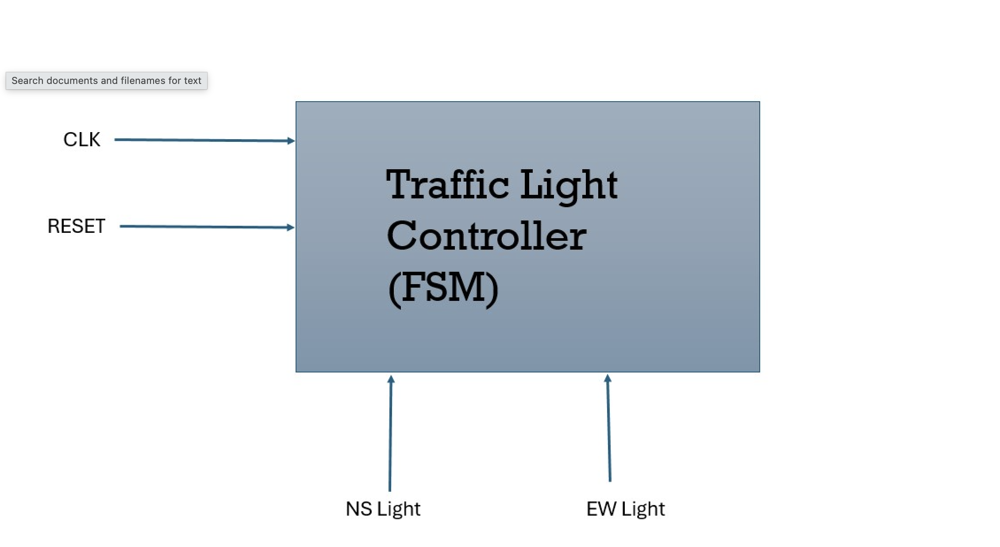
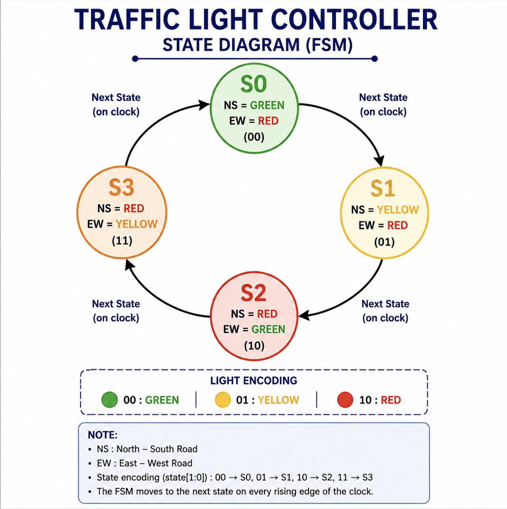
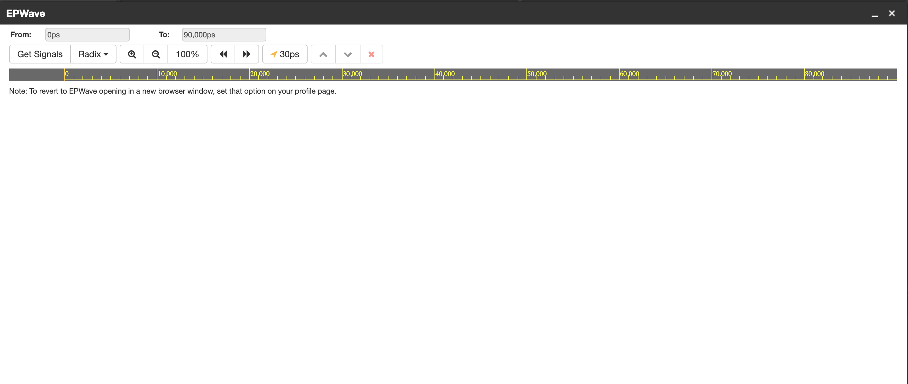

# Traffic Light Controller using Verilog HDL

## Overview

This project implements a Finite State Machine (FSM) based Traffic Light Controller using Verilog HDL.

The controller manages traffic flow for a four-way intersection by controlling the North-South and East-West traffic lights.

---

## Features

* Finite State Machine (FSM) design
* Four traffic light states
* Synchronous clock operation
* Asynchronous reset
* Verilog Testbench
* Functional verification using Icarus Verilog
* Waveform analysis using EPWave

---

## State Sequence

S0 → S1 → S2 → S3 → S0

| State | North-South | East-West |
| ----- | ----------- | --------- |
| S0    | Green       | Red       |
| S1    | Yellow      | Red       |
| S2    | Red         | Green     |
| S3    | Red         | Yellow    |

---

## Project Structure

```
Traffic-Light-Controller/
│
├── src/
├── tb/
├── waveform/
├── block_diagram/
├── state_diagram/
└── README.md
```

---

## Tools Used

* Verilog HDL
* VS Code
* Icarus Verilog
* EPWave
* Git
* GitHub

---

## Simulation Flow

1. Compile the design

```
iverilog -o traffic src/traffic_light.v tb/traffic_light_tb.v
```

2. Run simulation

```
vvp traffic
```

3. View waveform in EPWave

---

## Output Files

* Block Diagram
* FSM State Diagram
* Simulation Waveform

---

## Author

Developed as a VLSI RTL Design Project.
Ishita Chaudhary

# Traffic Light Controller using Verilog HDL

## Block Diagram



---

## FSM State Diagram



---

## Simulation Waveform

